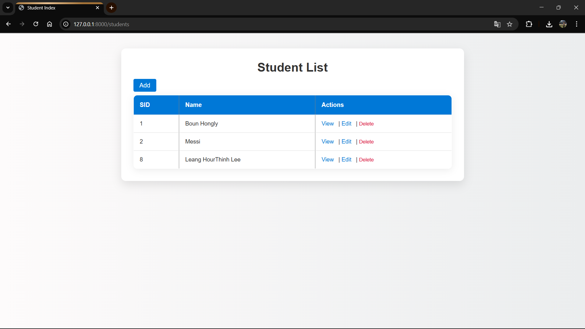
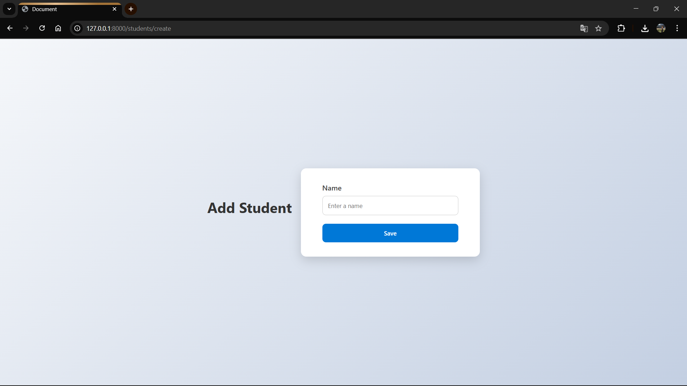
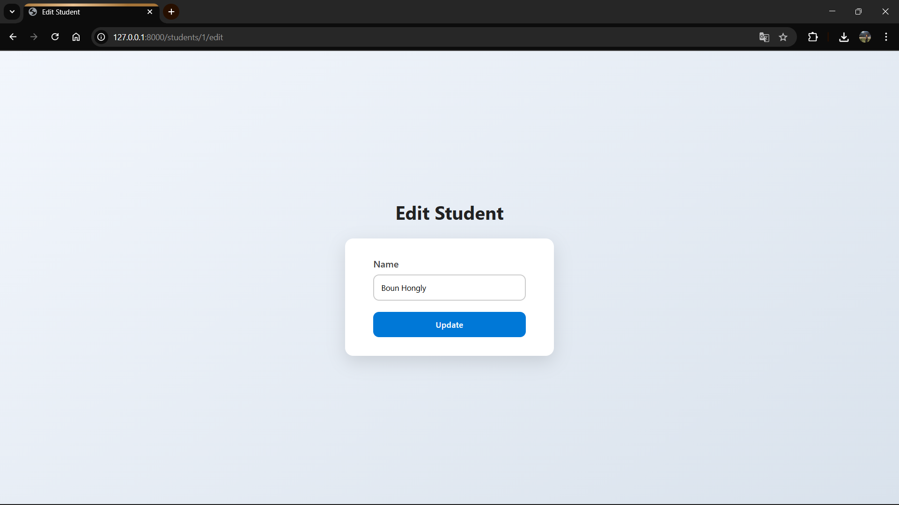
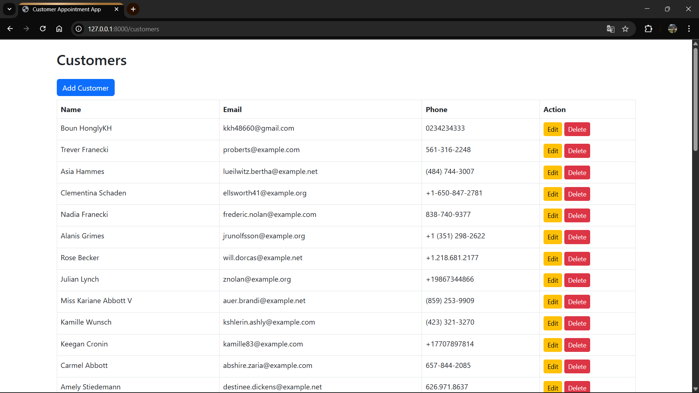

  Small projects for using python and Laravel to connect with database 
  
1. Python basic connect with database MySql  (CRUD)

2. my laravel project i do from my university using database PostgreSQL
     + Student System (CRUD) 
   <table>
     <thead>
       <th>
       </th>
        <th>
       </th>
        <th>
       </th>
     </thead>
   </table>
     
       + Customer Appoitment Booking

     
    
    
    
    
       
   
