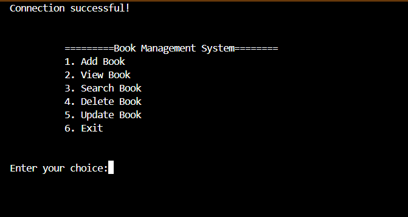

  Small projects for using python and Laravel to connect with database 
  
1. Python basic connect with database MySql  (CRUD)

2. my laravel project i do from my university using database PostgreSQL 
       + Student System (CRUD)
    
    
    
       + Customer Appoitment Booking

     
    
    
    
    
       
   
